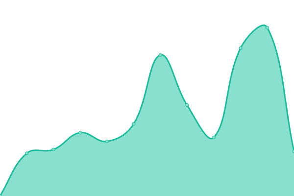
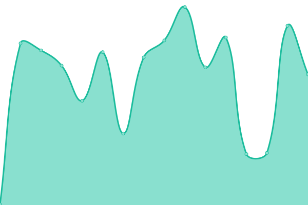
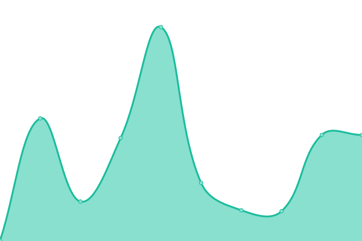

# [📈 Live Status](https://status.bloo.io): <!--live status--> **🟩 All systems operational**

This repository contains the open-source uptime monitor and status page for [Bloo - Team Work](https://www.bloo.io), powered by [Upptime](https://github.com/upptime/upptime).

With [Upptime](https://upptime.js.org), you can get your own unlimited and free uptime monitor and status page, powered entirely by a GitHub repository. We use [Issues](https://github.com/bloohq/status/issues) as incident reports, [Actions](https://github.com/bloohq/status/actions) as uptime monitors, and [Pages](https://status.bloo.io) for the status page.

<!--start: status pages-->
<!-- This summary is generated by Upptime (https://github.com/upptime/upptime) -->
<!-- Do not edit this manually, your changes will be overwritten -->
<!-- prettier-ignore -->
| URL | Status | History | Response Time | Uptime |
| --- | ------ | ------- | ------------- | ------ |
|  [Blue App](https://app.blue.cc) | 🟩 Up | [blue-app.yml](https://github.com/bloohq/status/commits/HEAD/history/blue-app.yml) | 

 469ms
     
 | 

<a href="https://status.blue.cc/history/blue-app">100.00%</a>
    

|  [Blue API](https://api.bloo.io) | 🟩 Up | [blue-api.yml](https://github.com/bloohq/status/commits/HEAD/history/blue-api.yml) | 

 1043ms
     
 | 

<a href="https://status.blue.cc/history/blue-api">100.00%</a>
    

|  [Blue Website](https://www.blue.cc) | 🟩 Up | [blue-website.yml](https://github.com/bloohq/status/commits/HEAD/history/blue-website.yml) | 

 255ms
     
 | 

<a href="https://status.blue.cc/history/blue-website">100.00%</a>
    

|  [Blue Community](https://ask.blue.cc) | 🟩 Up | [blue-community.yml](https://github.com/bloohq/status/commits/HEAD/history/blue-community.yml) | 

 523ms
     
 | 

<a href="https://status.blue.cc/history/blue-community">100.00%</a>
    

<!--end: status pages-->

[**Visit our status website →**](https://status.bloo.io)

## 📄 License

- Powered by: [Upptime](https://github.com/upptime/upptime)
- Code: [MIT](./LICENSE) © [Bloo - Team Work](https://www.bloo.io)
- Data in the `./history` directory: [Open Database License](https://opendatacommons.org/licenses/odbl/1-0/)
